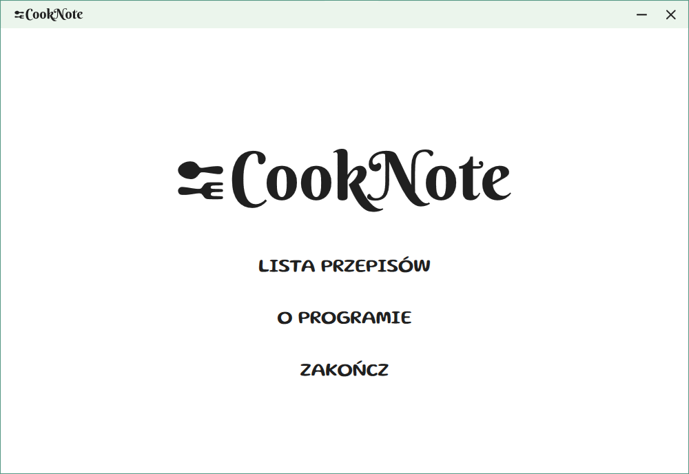
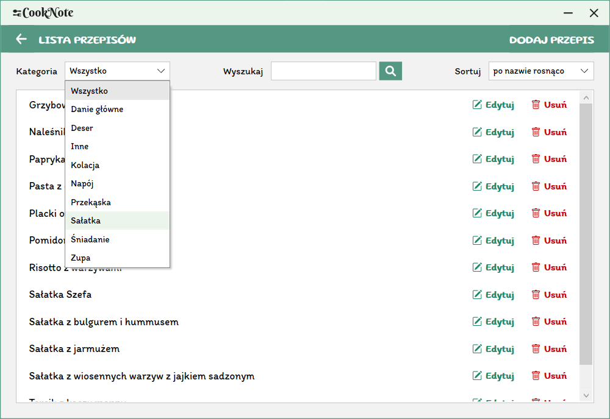

# CookNote
The CookNote application was implemented using Windows Presentation Foundation (WPF) technology for developing desktop applications with a Graphical User Interface (GUI) for Windows. It was created for the purpose of storing and managing recipes. It allows you to add, edit, show and save to text file all the recipes in the app.

## Table of contents
* [Technology](#technology)
* [Screenshots](#screenshots)

## Technology
Project is created with:
* .NET Core 3.1
* Windows Presentation Foundation (WPF)
* C#
* XAML
* SQLite

## Screenshots

    
    <em>Main menu</em>

 

    
    <em>Recipe list</em>

 

    
    <em>Add recipe</em>

